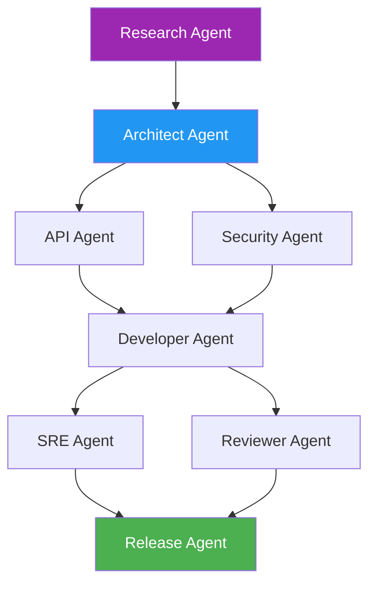

# DevFoundry 🏗️

**The Agentic Software Development Platform**

*From Idea to Deployed Code — in One Conversation*

[](#agents)
[](#llm-providers)
[](#gitops)
[](#governance)
[](#deployment)

## 🌍 Vision

DevFoundry is an **agent-driven software factory** that automates the full SDLC — from idea to deployment — by turning product concepts into working, secure, compliant, and deployable software through **collaborating AI agents**, structured workflows, and governance gates.

**Instead of humans manually coordinating dozens of tools, DevFoundry agents coordinate each stage of the SDLC using policies, context, and AI reasoning — just like a self-managed DevOps team.**

---

## 🧭 Core Purpose

DevFoundry exists to **eliminate the friction between ideation, design, coding, and deployment** in enterprise environments.

It's the **DevOps evolution**: from CI/CD → **AI-driven Continuous Software Creation**.

### The DevFoundry Promise
1. **Submit a Concept** → *"Build a secure API for asset onboarding with role-based access and audit logging"*
2. **AI Agents Generate Everything** → ADR, API Spec, Service Code, Tests, IaC, CI/CD Pipelines, Security Controls
3. **Deploy Automatically** → GitHub repository, Cloud Build, target environment deployment
4. **Enterprise Governance** → Every stage passes through agentic review & approval gates

---

## 🧩 Platform Components

| Layer | Function | Key Actors |
|-------|----------|------------|
| **Agent Orchestration** | Multi-agent graph executing SDLC steps (Research → ADR → API → Code → IaC → Test → Deploy) | Research Agent, Architect Agent, Dev Agent, SRE Agent, Security Agent |
| **Prompt Intelligence** | Contextual prompt library with role-based templates & chain-of-thought memory per agent | Model Orchestrator |
| **Workflow & Governance** | Defines approval workflows, RASCI mapping, sign-offs, rollback logic | PMO/Architecture Board |
| **Policy & Compliance** | Injects ISO 27001, OWASP, CIS, NIST controls into code, pipelines, and IaC | Compliance Agent |
| **UI & Collaboration** | GUI for non-technical users — visualize pipeline, approve ADRs, monitor builds | DevFoundry Studio |
| **Integration & Infrastructure** | GitHub, Cloud Build, Azure DevOps, Jira, Slack, Multi-LLM APIs | Connectors |

---

## 🧠 Agent Ecosystem

### Core Agents

| Agent | Role | Responsibilities |
|--------|------|------------------|
| 🧩 **Research Agent** | Requirements Analysis | Reads requirements, extracts goals, dependencies, risks. Suggests related standards/frameworks |
| 🏛️ **Architect Agent** | System Design | Generates ADRs, component diagrams, technology stack, interfaces, and design patterns |
| 🔌 **API Agent** | Interface Design | Designs OpenAPI specs, schema validation, endpoint documentation |
| 💻 **Developer Agent** | Code Generation | Writes production-ready backend/frontend code, unit tests, and Dockerfiles |
| 🔐 **Security Agent** | Security & Compliance | Enforces policy packs, injects security controls, runs SAST/DAST scans |
| ⚙️ **SRE Agent** | Infrastructure | Builds IaC (Terraform, Helm), CI/CD YAMLs, and deployment scripts |
| 🧾 **Reviewer Agent** | Quality Assurance | Performs code review, linting, documentation, and compliance validation |
| 📦 **Release Agent** | Deployment | Handles tagging, versioning, release notes, and deployment approvals |

### Agent Graph Execution

Each agent operates within a **dependency graph** defined by inputs and outputs:



---

## 🏗️ System Architecture

### 1️⃣ Input Layer
- **GUI Interface** (DevFoundry Studio)
- **CLI/API** for programmatic access
- **Integration APIs** (Jira, Slack, etc.)

### 2️⃣ Agent Graph Execution
Workflow engine (Temporal/Argo) manages the DAG:
```
Research → ADR → API Spec → Code → Tests → IaC → Security → Deploy
```

### 3️⃣ Artifact Persistence
- **Version Control**: All generated assets in GitHub/GitLab
- **Metadata Storage**: Postgres/Firestore for run tracking
- **Audit Trails**: Complete lineage and approval workflows

### 4️⃣ CI/CD Integration
- **Multi-Platform**: Cloud Build, GitHub Actions, Azure Pipelines
- **Feedback Loops**: Build status monitoring and workflow updates
- **GitOps**: Pull request workflows with automated reviews

### 5️⃣ Observability & Governance
- **Audit Logs**: Complete compliance trails
- **Agent Telemetry**: Token usage, success rates, performance metrics
- **Policy Compliance**: Real-time compliance reporting

---

## 🖥️ DevFoundry Studio (UI Experience)

### Core Interfaces
- **🚀 Launchpad** → Start new projects, define inputs, view generated ADRs
- **🕸️ Agent Graph Visualizer** → Real-time agent execution status and outputs
- **📁 Artifact Explorer** → Browse generated APIs, IaC, test coverage, compliance results
- **📊 Command Dashboard** → Project velocity, policy compliance %, cost usage, agent reliability
- **✅ Approval Console** → Human-in-the-loop governance and sign-offs

### User Roles
- **Product Owners** → Submit requirements, approve ADRs, monitor delivery
- **Architects** → Review technical decisions, approve design patterns
- **Security Teams** → Validate compliance, approve security controls
- **Operations** → Monitor deployments, manage infrastructure

---

## 🛡️ Security & Compliance Framework

Every artifact created is **automatically tagged** with its control lineage:

### Built-in Compliance
- **ADR**: Architecture controls (network segregation, auth patterns)
- **Code**: Secure coding checks (OWASP Top 10, CWE prevention)
- **IaC**: CIS benchmarks, cloud security best practices
- **Pipelines**: ISO 27001 and NIST CSF mappings

### Security-by-Design
```yaml
Compliance Frameworks:
  - ISO 27001
  - SOC 2 Type II
  - NIST Cybersecurity Framework
  - OWASP ASVS
  - CIS Controls
  
Security Controls:
  - Static Application Security Testing (SAST)
  - Dynamic Application Security Testing (DAST)
  - Infrastructure as Code Security Scanning
  - Supply Chain Security (SBOM generation)
  - Runtime Security Monitoring
```

---

## 🔗 Integration Ecosystem

### LLM Providers
- **Google Vertex AI** (Gemini models)
- **OpenAI** (GPT-4, GPT-4 Turbo)
- **Anthropic Claude**
- **Azure OpenAI**
- **Local/Private Models** (Llama, Mistral)

### Development Platforms
- **Version Control**: GitHub, GitLab, Bitbucket
- **CI/CD**: Cloud Build, GitHub Actions, Jenkins, Azure DevOps
- **Infrastructure**: Cloud Run, Kubernetes, App Services, Lambda

### Enterprise Integration
- **Identity**: Okta, Azure AD, Google Cloud IAM
- **Project Management**: Jira, Azure DevOps, Linear
- **Communication**: Slack, Microsoft Teams
- **Monitoring**: Grafana, Prometheus, ELK, Cloud Logging

---

## 🚀 Deployment Modes

| Mode | Description | Use Case |
|------|-------------|----------|
| **Cloud SaaS** | Hosted orchestration with GitHub & multi-LLM integration | Startups, SMBs, rapid prototyping |
| **Enterprise Self-Hosted** | Deploy in customer's cloud with private model routing | Large enterprises, regulated industries |
| **Air-Gapped** | For defense or critical infrastructure using local LLMs | Government, defense, critical infrastructure |

---

## 📈 Value Proposition

### By Stakeholder

| Stakeholder | Value Delivered |
|-------------|----------------|
| **Developers** | Focus on business logic, not boilerplate; automated scaffolding and testing |
| **Architects** | Consistent ADRs, automated design guardrails, compliance by design |
| **Security Teams** | Automated policy enforcement, complete audit trails, security-by-design |
| **Product Teams** | Faster time-to-market, predictable delivery, measurable quality |
| **Executives** | Reduced development costs, standardized processes, accelerated innovation |

### Business Impact
- **⚡ 10x Faster Development** → Concept to deployment in hours, not weeks
- **🔒 100% Compliance** → Built-in governance and audit trails
- **💰 60% Cost Reduction** → Automated manual processes and reduced rework
- **📈 Predictable Delivery** → Standardized patterns and automated quality gates

---

## 🛠️ Current Implementation Status

### ✅ Phase 1: Foundation (Current)
- ✅ Agent-based architecture
- ✅ Basic workflow orchestration  
- ✅ Multi-provider LLM integration (Vertex AI)
- ✅ GitHub integration and artifact generation
- ✅ Enterprise folder structure

### 🚧 Phase 2: Agent Intelligence (In Progress)
- 🔄 Multi-agent graph with dependencies
- 🔄 Enhanced prompt engineering and context management
- 🔄 Persistent workflow state and recovery
- 🔄 Multi-model routing and fallback strategies

### 📋 Phase 3: Governance & UI (Planned)
- 📋 DevFoundry Studio (React frontend)
- 📋 Human-in-the-loop approval workflows
- 📋 Policy enforcement and compliance gates
- 📋 Role-based access control and permissions

### 🎯 Phase 4: Enterprise Features (Roadmap)
- 🎯 GitOps PR-based workflows
- 🎯 Advanced observability and metrics
- 🎯 Security scanning integration
- 🎯 Multi-cloud IaC generation

---

## 🚀 Quick Start

### Generate Your First Service

```bash
# Install DevFoundry CLI
npm install -g @devfoundry/cli

# Initialize new project
devfoundry init my-service

# Generate complete service
devfoundry generate \
  --name "user-management-api" \
  --requirement "Secure user management with RBAC, audit logging, and REST API" \
  --architecture "microservice" \
  --deployment "cloud-run"
```

### Expected Output
```json
{
  "success": true,
  "run_id": "df-20241018-001",
  "agents_completed": 8,
  "artifacts_generated": {
    "adr": "docs/ADR.md",
    "api_spec": "openapi.yaml", 
    "source_code": "src/",
    "tests": "tests/",
    "infrastructure": "terraform/",
    "pipelines": ".github/workflows/"
  },
  "repository_url": "https://github.com/your-org/user-management-api",
  "deployment_status": "pipeline_triggered",
  "compliance_score": 98
}
```

---

## 🎯 Tagline Options

- **"From Idea to Deployed Code — in One Conversation"**
- **"The AI-Powered Software Factory"**  
- **"Governed DevOps meets Agent Intelligence"**
- **"Your Enterprise SDLC, Re-engineered by Agents"**
- **"Where Product Vision Becomes Production Reality"**

---

## 🤝 Enterprise Adoption

### Getting Started
1. **[Request Demo](https://devfoundry.com/demo)** → See the complete platform in action
2. **[Enterprise Trial](https://devfoundry.com/trial)** → 30-day evaluation with full support
3. **[Architecture Review](https://devfoundry.com/consulting)** → Custom integration planning

### Support Tiers
- **Community** → GitHub issues and community support
- **Professional** → SLA-backed support with dedicated success manager  
- **Enterprise** → 24/7 support, custom agents, private cloud deployment

---

## 📜 License

DevFoundry Platform - Enterprise License  
© 2024 DevFoundry. All rights reserved.

For licensing inquiries and enterprise agreements:  
**[enterprise@devfoundry.com](mailto:enterprise@devfoundry.com)**

---

**Built with ❤️ by the DevFoundry team — where human creativity meets artificial intelligence to create the future of software development.**