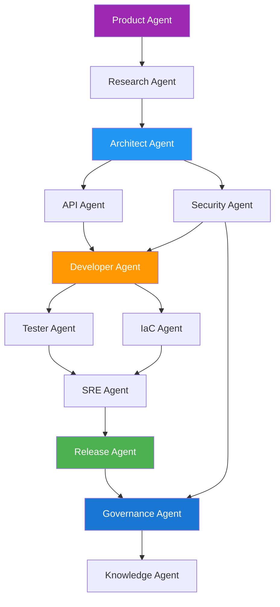

# DevFoundry 🏗️

**The Agentic Software Development Platform**

*Transform any idea into a governed, deployable product — automatically*

[](#agent-ecosystem)
[](#end-to-end-lifecycle)
[](#governance--compliance)
[](#r1-platform-stack)
[](#enterprise-readiness)

---

## 🔮 The DevFoundry Promise

DevFoundry is not just a code generator — it's a **self-driving SDLC engine** that can:

1. **🧭 Understand** a business or technical concept
2. **🏛️ Architect** the solution with enterprise patterns
3. **⚙️ Generate and test** the code with built-in security
4. **🚀 Deploy** it securely to the cloud
5. **🧩 Govern** and monitor it through policy-based automation

**Every stage is executed and validated by a system of collaborating AI agents, ensuring speed, consistency, and compliance.**

---

## 🧩 End-to-End Lifecycle

DevFoundry delivers transformation through **five coordinated stages**:

| Stage | Purpose | Automated Outputs | Responsible Agents | GCP Components |
|-------|---------|-------------------|-------------------|----------------|
| **🧭 Conceptualise** | Capture business intent, requirements, and context | Vision Document, Requirement Matrix, Risk Register, Standards Mapping | Product Agent, Research Agent, Compliance Agent | Vertex AI, Firestore, Cloud Run |
| **🏛️ Architect** | Transform requirements into enterprise architecture | ADRs, Design Diagrams, OpenAPI Specs, Security Controls | Architect Agent, API Agent, Security Agent | Vertex AI, Cloud Storage, GitHub |
| **⚙️ Engineer** | Generate and validate implementation code and infrastructure | Source Code, Tests, IaC Templates, CI/CD Pipelines | Developer Agent, IaC Agent, Tester Agent | Cloud Build, Artifact Registry, Secret Manager |
| **🚀 Deploy** | Release to cloud with runtime observability | Cloud Services, Monitoring Dashboards, Rollback Rules | Release Agent, SRE Agent | Cloud Run, Monitoring, Logging, Pub/Sub |
| **🧩 Govern** | Enforce governance, traceability, and continuous compliance | Audit Logs, SBOMs, Compliance Reports, Metrics Feedback | Governance Agent, Knowledge Agent | Cloud Logging, IAP, Firestore |

---

## 🧠 Agent Ecosystem

DevFoundry uses a **graph of specialized agents**, each performing a discrete stage of the software lifecycle. Agents interact asynchronously, sharing artifacts and state through a central orchestrator.

### Core Agents

| Agent | Function | Key Deliverables |
|-------|----------|------------------|
| **🎯 Product Agent** | Captures initial ideas, aligns to business goals, identifies success metrics | Concept Brief, Feature Map |
| **🔍 Research Agent** | Gathers domain context, comparable architectures, standards, and dependencies | Reference Material, Control Catalogue |
| **🏛️ Architect Agent** | Translates requirements into conceptual, logical, and physical architectures | ADRs, Design Diagrams |
| **🔌 API Agent** | Defines interfaces, schemas, and OpenAPI specs with security controls | API Spec, Schema Definitions |
| **💻 Developer Agent** | Generates application code adhering to style guides and security baselines | Service Code, Tests, Dockerfile |
| **🧪 Tester Agent** | Creates test suites and validates build integrity through CI pipelines | Test Reports, Coverage Results |
| **⚙️ IaC Agent** | Builds Terraform or Helm modules for reproducible environments | IaC Scripts, Deployment Configs |
| **🚀 SRE Agent** | Automates deployment, scaling, rollback, and observability setups | Deployment Pipelines, Dashboards |
| **🔐 Security Agent** | Injects controls, performs SBOM generation, vulnerability scans | SBOM, Vulnerability Reports |
| **🧾 Governance Agent** | Enforces approval workflows, tracks RASCI roles, maintains audit logs | Sign-off Records, Audit Trails |
| **🧠 Knowledge Agent** | Monitors operations, analyzes feedback, suggests optimizations | Insights Report, Improvements |

### Agent Graph Execution



---

## ⚙️ How DevFoundry Realizes DevOps

DevFoundry embeds the **seven pillars of modern DevOps** directly into its architecture:

| DevOps Pillar | DevFoundry Mechanism |
|---------------|----------------------|
| **Continuous Integration** | Every agent commit triggers Cloud Build with linting, tests, SBOM, and vulnerability scans |
| **Continuous Delivery** | Cloud Build pipelines auto-deploy to Cloud Run with approval and compliance gates |
| **Continuous Testing** | Unit, integration, and compliance tests generated and executed automatically |
| **Continuous Security** | Policy packs, license checks, secret scanning, SAST/DAST in every build |
| **Continuous Monitoring** | Cloud Monitoring dashboards with build health, latency, and uptime metrics |
| **Continuous Feedback** | Production data feeds back to Knowledge Agent for next-cycle improvements |
| **Continuous Compliance** | Automated control mapping (ISO 27001, NIST CSF) and evidence collection |

---

## 🧭 Technical Architecture

### 1️⃣ Agent Orchestration Layer
- Executes multi-step DAG workflows
- Manages agent states, retries, and artifact sharing
- Built on lightweight task orchestration (Temporal/Argo/Celery)

### 2️⃣ Prompt Intelligence Layer
- Library of structured prompt templates per agent
- Context persistence for consistency across generations
- Multi-model routing (Vertex AI primary, OpenAI/Claude support)

### 3️⃣ Workflow & Governance Layer
- Manages approvals, RASCI roles, and evidence trails
- Stores decisions, artifact hashes, and approval events in Firestore

### 4️⃣ Policy & Compliance Layer
- Embeds control sets (OWASP, CIS, ISO, NIST) into artifacts
- Validates IaC and pipeline configs for compliance before merge

### 5️⃣ Integration & Infrastructure Layer
- Connectors for GitHub, Cloud Build, Secret Manager, Artifact Registry
- IaC via Terraform ensures reproducible deployments
- Observability through Cloud Logging & Monitoring

### 6️⃣ User Experience Layer
- **DevFoundry Studio** web console for:
  - Submitting ideas and configuring agents
  - Visualizing agent graph and pipeline progress
  - Reviewing ADRs, approving builds, viewing artifacts
  - Real-time status via Pub/Sub updates

---

## 🧱 R1 Platform Stack (Google Cloud)

| Domain | Service | Purpose |
|--------|---------|---------|
| **Compute** | Cloud Run | Host Orchestrator, UI, and generated services |
| **CI/CD** | Cloud Build | Automate lint, test, build, deploy, scan |
| **Artifacts** | Artifact Registry | Store container images and build outputs |
| **IaC** | Terraform + Cloud Storage | Reproducible environments, centralized state |
| **Security** | Secret Manager, IAP, IAM | Secure secrets and access control |
| **Observability** | Cloud Logging + Monitoring | End-to-end observability |
| **Data** | Firestore / Cloud SQL | Run metadata, audit logs, artifact records |
| **AI Models** | Vertex AI | Primary LLM provider for all agent interactions |

---

## 🛡️ Governance & Compliance

DevFoundry operates within **regulated, enterprise environments**, embedding governance directly into pipelines:

### Built-in Governance
- **Role-based approvals** for each SDLC stage (Architecture, Security, QA, Release)
- **Audit evidence** automatically generated: ADRs, SBOMs, vulnerability reports, test results
- **Traceability** of every decision and artifact hash stored immutably
- **Compliance packs** for ISO 27001, NIST CSF, and CIS benchmarks
- **Security gates** that prevent deployment on policy violations

### Compliance Frameworks
```yaml
Standards Supported:
  - ISO 27001 (Information Security)
  - SOC 2 Type II (Trust Services)
  - NIST CSF (Cybersecurity Framework)
  - OWASP ASVS (Application Security)
  - CIS Controls (Critical Security Controls)
  
Evidence Generation:
  - Architecture Decision Records (ADRs)
  - Software Bill of Materials (SBOM)
  - Vulnerability Assessment Reports
  - Test Coverage and Results
  - Deployment Approval Trails
```

---

## 📊 Lifecycle Example

### User Input
*"Build a secure API for asset onboarding with role-based access and audit logging."*

### System Flow
1. **🧭 Conceptualize**: Product Agent analyzes goal → Research Agent identifies security frameworks → Compliance Agent applies ISO 27001 controls
2. **🏛️ Architect**: Architect Agent drafts ADR + component diagram → API Agent designs endpoints with RBAC schema  
3. **⚙️ Engineer**: Developer Agent generates FastAPI code, tests, Dockerfile → IaC Agent writes Terraform → Tester Agent validates
4. **🚀 Deploy**: Cloud Build pipeline runs tests, builds image, deploys to Cloud Run
5. **🧩 Govern**: Security Agent runs SBOM + scan → Governance Agent captures approval trail → Knowledge Agent logs metrics

### Outcome
**Within minutes**, a fully compliant, observable, and version-controlled microservice is deployed to Cloud Run — with all documentation, security scans, and governance approvals in place.

---

## 🏢 Enterprise Readiness

| Capability | Description |
|------------|-------------|
| **Multi-tenant Security** | Org/project-based isolation with per-team IAM roles |
| **Audit & Traceability** | Immutable logs for every artifact and approval decision |
| **Resilience** | Stateless Cloud Run services with auto-scaling and rollback |
| **Interoperability** | Modular architecture — LLM, CI/CD, and IaC layers are pluggable |
| **Extensibility** | New agents or policy packs without affecting core orchestration |

---

## 🚀 Release 1 Scope

### Current Capabilities
- ✅ **Core agent orchestration** (Research → ADR → API → Code → Test → Deploy)
- ✅ **CI/CD integration** via Cloud Build and Cloud Run
- ✅ **Vertex AI** as primary model provider
- ✅ **Basic governance** UI for approvals and evidence
- ✅ **Policy enforcement** (lint, tests, SBOM, vulnerability scan, license check)
- ✅ **Terraform-based IaC** for reproducible environments

### Outcome
A **fully functional, end-to-end agentic DevOps pipeline** that can take a requirement, produce code, deploy it, and enforce compliance — all within GCP.

---

## 🗺️ Roadmap Highlights

| Milestone | Focus | Key Additions |
|-----------|-------|---------------|
| **R1.1** | Security Attestation & Provenance | Container signing (Cosign), SLSA L3 compliance, blueprint catalog |
| **R1.2** | Multi-Cloud & Model Routing | Azure/AWS deployments, Anthropic & OpenAI integration, cost telemetry |
| **R1.3** | Multi-Service Architectures | Monorepo graphs, cross-service dependencies, orchestration visualization |
| **R2.0** | Autonomous SDLC Governance | Self-optimizing agents, predictive quality scoring, generative documentation |

---

## 🚀 Quick Start

### DevFoundry Studio (Web Interface)
```
https://studio.devfoundry.com
```

### DevFoundry CLI
```bash
# Install CLI
npm install -g @devfoundry/cli

# Initialize project
devfoundry init asset-onboarding-api

# Configure requirements
devfoundry config set \
  --architecture "microservice" \
  --deployment "cloud-run" \
  --compliance "iso-27001"

# Generate complete solution
devfoundry generate \
  --requirement "Secure API for asset onboarding with RBAC and audit logging"
```

### Expected Output
```json
{
  "success": true,
  "run_id": "df-20241018-001",
  "agents_completed": 11,
  "lifecycle_stages": {
    "conceptualize": "✅ Requirements captured with ISO 27001 controls",
    "architect": "✅ ADR and API design with RBAC schema completed", 
    "engineer": "✅ FastAPI code, tests, and Terraform generated",
    "deploy": "✅ Cloud Run deployment with monitoring configured",
    "govern": "✅ SBOM generated, compliance validated, audit trail created"
  },
  "artifacts": {
    "repository": "https://github.com/your-org/asset-onboarding-api",
    "service_url": "https://asset-onboarding-api-12345.run.app",
    "monitoring": "https://console.cloud.google.com/monitoring/dashboards/...",
    "compliance_score": 98,
    "sbom": "artifacts/sbom.json",
    "audit_trail": "governance/audit-20241018-001.json"
  }
}
```

---

## 💡 Why DevFoundry Matters

### The Problem
**Traditional DevOps automates deployment, not development.**

### The Solution
**DevFoundry bridges that gap** — it turns DevOps into **Dev-through-Ops**, unifying conceptual design, engineering, delivery, and compliance under one intelligent, governed system.

### The Impact
```
DevFoundry = Dev + Foundry
```
A platform where software is **forged intelligently**, not just written.

**This is how the next generation of enterprises will build software:**
- ⚡ **Faster** — concept to deployment in hours
- 🔒 **Safer** — security and compliance by design  
- 📋 **Compliant** — automated governance and audit trails
- 🔄 **Self-improving** — continuous learning and optimization

---

## 🎯 Value Proposition

### Business Impact
- **⚡ 10x Development Speed** → Concept to deployment in hours, not weeks
- **💰 60% Cost Reduction** → Eliminate manual processes and rework
- **🔒 100% Compliance** → Built-in governance and security controls
- **📈 Predictable Delivery** → Standardized patterns and automated quality gates
- **🚀 Innovation Acceleration** → Focus on business logic, not infrastructure

### Stakeholder Benefits
| Stakeholder | Value Delivered |
|-------------|-----------------|
| **Executives** | Faster time-to-market, reduced costs, predictable delivery, competitive advantage |
| **Product Teams** | Focus on features, not infrastructure; automated quality and compliance |  
| **Architects** | Consistent patterns, automated ADRs, enterprise-grade design enforcement |
| **Developers** | Generate boilerplate automatically, focus on business logic and innovation |
| **Security Teams** | Security-by-design, automated compliance, complete audit trails |
| **Operations** | Standardized deployments, automated monitoring, self-healing infrastructure |

---

## 🤝 Enterprise Adoption

### Getting Started
1. **[Schedule Demo](https://devfoundry.com/demo)** → See the complete platform in action
2. **[Architecture Workshop](https://devfoundry.com/workshop)** → Custom integration and migration planning  
3. **[Enterprise Trial](https://devfoundry.com/trial)** → 30-day evaluation with dedicated support

### Deployment Options
- **🌐 Cloud SaaS** → Hosted platform with multi-tenant security
- **🏢 Enterprise Self-Hosted** → Private cloud deployment with custom controls
- **🔒 Air-Gapped** → On-premises with local LLMs for defense/critical infrastructure

### Support Tiers
- **Community** → GitHub support and documentation
- **Professional** → SLA support with dedicated success manager
- **Enterprise** → 24/7 support, custom agents, private deployment, consulting services

---

## 📞 Contact

**Enterprise Inquiries**: [enterprise@devfoundry.com](mailto:enterprise@devfoundry.com)  
**Technical Questions**: [support@devfoundry.com](mailto:support@devfoundry.com)  
**Partnership Opportunities**: [partners@devfoundry.com](mailto:partners@devfoundry.com)

---

## 📜 License

DevFoundry Platform - Enterprise License  
© 2024 DevFoundry. All rights reserved.

---

**Built with ❤️ by the DevFoundry team**  
*Where human creativity meets artificial intelligence to create the future of software development*

**DevFoundry: The evolution from DevOps to Dev-through-Ops**