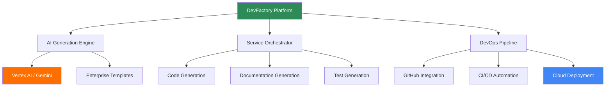

# DevFoundry 🏗️

**The Agentic Software Development Platform**

*From Idea to Deployed Code — in One Conversation*

[](#agents)
[](#llm-providers)
[](#gitops)
[](#governance)
[](#deployment)

## 🎯 **Overview**

DevFactory is an enterprise-grade platform that transforms natural language requirements into production-ready, cloud-native microservices. Powered by Google Vertex AI and built on modern cloud infrastructure, it automates the complete development lifecycle from architectural decisions to deployment-ready applications.

### **🚀 Key Capabilities**
- **Intelligent Service Generation**: AI-powered creation of complete microservices
- **Enterprise Architecture**: Production-ready patterns and best practices
- **Cloud-Native Deployment**: Containerized services ready for Kubernetes/Cloud Run
- **Automated Documentation**: ADRs, OpenAPI specs, and comprehensive guides
- **Quality Assurance**: Built-in testing frameworks and validation

---

## ✨ **Platform Features**

### 🤖 **Advanced AI Engine**
- **Primary AI**: Google Vertex AI with latest Gemini models
- **Intelligent Fallbacks**: Robust template system ensuring 100% availability
- **Context-Aware**: Understands enterprise patterns and architectural requirements
- **Continuous Learning**: Improves with each generation cycle

### 🏗️ **Enterprise Architecture**
- **Microservices-First**: Native support for distributed systems
- **Security-by-Design**: Built-in authentication, authorization, and compliance
- **Scalable Infrastructure**: Auto-scaling, load balancing, and high availability
- **DevOps Integration**: CI/CD pipelines, monitoring, and observability

### 📦 **Complete Service Generation**
- **Architecture Decision Records (ADR)**: Documented architectural choices
- **OpenAPI 3.1 Specifications**: Industry-standard API documentation
- **Production Code**: FastAPI applications with health checks, CRUD operations
- **Test Suites**: Comprehensive pytest test coverage
- **Deployment Configuration**: Docker, Kubernetes, and Cloud Run ready

### 🔄 **DevOps Integration**
- **GitHub Integration**: Automated repository management and commits
- **CI/CD Pipelines**: Cloud Build triggers and deployment automation  
- **Quality Gates**: Automated testing, linting, and security scanning
- **Monitoring**: Structured logging, metrics, and alerting

---

## 🏗️ **Architecture**



### **Core Platform Components**

| Component | Technology | Purpose |
|-----------|------------|---------|
| **Orchestrator API** | FastAPI + Cloud Run | Central service coordination and request processing |
| **AI Generation Engine** | Google Gen AI SDK | Intelligent content creation with Vertex AI |
| **Template System** | Jinja2 + Custom | Enterprise-grade fallback templates |
| **Repository Manager** | PyGithub + Git | Automated source code management |
| **Deployment Pipeline** | Cloud Build + Docker | Containerized deployment automation |
| **Monitoring Stack** | Cloud Logging + Metrics | Production observability and alerting |

---

## 🚀 **Quick Start**

### **Generate a Microservice**

```bash
# Generate a complete microservice
curl -X POST "https://devfactory-api.example.com/generate" \
  -H "Content-Type: application/json" \
  -d '{
    "service_name": "user-management-api",
    "requirements": "Create a secure User Management API with authentication, RBAC, CRUD operations, and audit logging using FastAPI and PostgreSQL"
  }'
```

### **Expected Output**

```json
{
  "success": true,
  "service_url": "https://github.com/your-org/user-management-api",
  "deployment_status": "pipeline_triggered",
  "estimated_completion": "5-10 minutes"
}
```

---

## 📁 **Generated Service Structure**

DevFactory creates complete, production-ready projects:

```
generated-microservice/
├── docs/
│   ├── ADR.md                    # Architecture Decision Record
│   ├── API.md                    # API Documentation
│   └── DEPLOYMENT.md             # Deployment Guide
├── src/
│   ├── api/
│   │   ├── __init__.py
│   │   ├── main.py               # FastAPI application
│   │   ├── models/               # Pydantic models
│   │   ├── routes/               # API endpoints
│   │   └── services/             # Business logic
│   └── tests/
│       ├── unit/                 # Unit tests
│       ├── integration/          # Integration tests
│       └── e2e/                  # End-to-end tests
├── infrastructure/
│   ├── Dockerfile                # Container configuration
│   ├── docker-compose.yml        # Local development
│   ├── k8s/                      # Kubernetes manifests
│   └── terraform/                # Infrastructure as Code
├── .github/
│   └── workflows/                # CI/CD pipelines
├── openapi.yaml                  # OpenAPI specification
├── requirements.txt              # Python dependencies
└── README.md                     # Service documentation
```

---

## 🛠️ **Enterprise Configuration**

### **Environment Setup**

```bash
# Required environment variables
export DEVFACTORY_PROJECT_ID="your-gcp-project"
export DEVFACTORY_REGION="us-central1"
export GITHUB_ORGANIZATION="your-org"
export AI_MODEL_PREFERENCE="gemini-2.0-flash-exp"
```

### **Security Configuration**

```yaml
# Service Account Configuration
service_account:
  name: "devfactory-orchestrator"
  roles:
    - "aiplatform.user"
    - "secretmanager.secretAccessor"
    - "source.admin"
    - "cloudbuild.builds.builder"

# Secret Manager Configuration
secrets:
  - name: "GITHUB_PAT"
    description: "GitHub Personal Access Token"
  - name: "DATABASE_URL" 
    description: "PostgreSQL connection string"
```

---

## 📊 **Enterprise Features**

### **🔐 Security & Compliance**
- **Zero-Trust Architecture**: Every component is authenticated and authorized
- **Secret Management**: Integration with Google Secret Manager and HashiCorp Vault
- **Audit Logging**: Complete audit trail for compliance requirements
- **RBAC Integration**: Role-based access control for all operations

### **📈 Scalability & Performance**
- **Auto-Scaling**: Horizontal and vertical scaling based on demand
- **Load Balancing**: Intelligent traffic distribution
- **Caching**: Multi-level caching for optimal performance
- **CDN Integration**: Global content distribution

### **🔍 Monitoring & Observability**
- **Structured Logging**: JSON-formatted logs with correlation IDs
- **Metrics & Alerting**: Prometheus-compatible metrics and alerts
- **Distributed Tracing**: OpenTelemetry integration for request tracing
- **Health Checks**: Comprehensive health monitoring and reporting

### **🚀 Developer Experience**
- **IDE Integration**: VS Code and IntelliJ plugins
- **Local Development**: Docker Compose for local testing
- **API Documentation**: Interactive Swagger/ReDoc interfaces
- **SDK Generation**: Client SDKs in multiple programming languages

---

## 🎯 **Business Value**

### **Development Acceleration**
- **⚡ 10x Faster**: Service creation from weeks to minutes
- **🔄 Consistent Quality**: Standardized patterns and best practices
- **🚫 Zero Setup**: No local development environment required
- **✨ Enterprise Standards**: Built-in security, monitoring, and documentation

### **Operational Excellence**
- **📈 Scalable**: Cloud-native architecture with auto-scaling
- **🔐 Secure**: Enterprise-grade security controls
- **📋 Compliant**: Built-in compliance frameworks (SOC2, GDPR, etc.)
- **🔧 Maintainable**: Automated updates and dependency management

### **Cost Optimization**
- **💰 Reduced Development Costs**: Automated service creation
- **⏱️ Faster Time-to-Market**: Rapid prototyping and deployment
- **🔧 Lower Maintenance**: Standardized patterns reduce technical debt
- **📊 Resource Efficiency**: Optimized cloud resource utilization

---

## 🚧 **Platform Development**

### **Technology Stack**
- **Runtime**: Python 3.11+ on Google Cloud Run
- **AI Engine**: Google Vertex AI with Gemini models
- **Database**: PostgreSQL with Redis caching
- **Message Queue**: Google Cloud Pub/Sub
- **Container**: Docker with distroless base images
- **Orchestration**: Kubernetes with Istio service mesh

### **Development Workflow**
```bash
# Clone repository
git clone https://github.com/nimergulf/devfactory.git
cd devfactory

# Setup development environment
make setup-dev

# Run tests
make test

# Local deployment
make run-local

# Deploy to staging
make deploy-staging
```

---

## 🤝 **Enterprise Support**

### **Support Tiers**
- **Community**: GitHub issues and community support
- **Professional**: SLA-backed support with response times
- **Enterprise**: Dedicated support team and custom features

### **Training & Onboarding**
- **Documentation**: Comprehensive guides and tutorials
- **Workshops**: Hands-on training sessions
- **Consulting**: Architecture reviews and best practices

---

## 📜 **License**

DevFactory Platform - Enterprise License  
© 2024 Nimergulf Organization. All rights reserved.

For licensing inquiries and enterprise agreements, contact: [enterprise@nimergulf.com](mailto:enterprise@nimergulf.com)

---

## 🌟 **Getting Started**

Ready to accelerate your microservices development? 

1. **[Request Demo](https://nimergulf.com/devfactory/demo)** - See DevFactory in action
2. **[Enterprise Trial](https://nimergulf.com/devfactory/trial)** - 30-day enterprise trial
3. **[Contact Sales](https://nimergulf.com/devfactory/contact)** - Custom enterprise deployment

**Built with ❤️ by the Nimergulf team using cutting-edge AI and cloud technologies.**