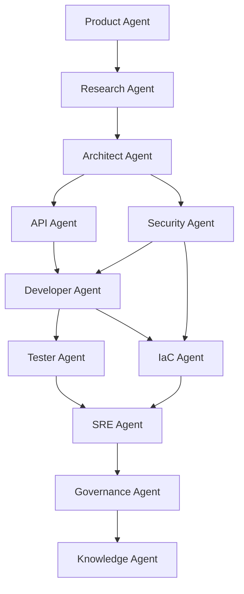

# DevFoundry Agent Specifications

## Agent Ecosystem Detailed Specifications

This document provides detailed specifications for each agent in the DevFoundry ecosystem, including inputs, outputs, decision logic, and quality criteria.

---

## Agent Execution Model

### Common Agent Interface

All agents implement a standard interface:

```python
class Agent(ABC):
    """Base agent interface"""
    
    @abstractmethod
    async def execute(self, context: AgentContext) -> AgentResult:
        """Execute agent logic"""
        pass
    
    @abstractmethod
    def validate_inputs(self, context: AgentContext) -> bool:
        """Validate input requirements"""
        pass
    
    @abstractmethod
    def validate_outputs(self, result: AgentResult) -> bool:
        """Validate output quality"""
        pass
```

### Agent Context Structure

```python
@dataclass
class AgentContext:
    """Shared context across agents"""
    workflow_id: str
    project_id: str
    artifacts: Dict[str, str]  # artifact_type -> storage_uri
    requirements: Dict[str, Any]
    metadata: Dict[str, Any]
    previous_outputs: List[AgentResult]
```

---

## 1. Product Agent

### Purpose
Capture and refine product concepts into structured requirements

### Inputs
- **Raw Concept**: Natural language description of the product idea
- **Business Context**: Industry, target users, business goals
- **Constraints**: Budget, timeline, technical constraints

### Outputs
- **Concept Brief**: Structured product vision document
- **Feature Map**: Prioritized feature list with user stories
- **Success Metrics**: KPIs and acceptance criteria
- **Requirement Matrix**: Functional and non-functional requirements

### Agent Logic

```python
class ProductAgent(Agent):
    async def execute(self, context: AgentContext) -> AgentResult:
        # Step 1: Analyze concept
        concept_analysis = await self.analyze_concept(
            context.requirements['raw_concept']
        )
        
        # Step 2: Extract features
        features = await self.extract_features(concept_analysis)
        
        # Step 3: Define success criteria
        success_metrics = await self.define_success_metrics(features)
        
        # Step 4: Create requirement matrix
        requirements = await self.create_requirement_matrix(
            features, success_metrics
        )
        
        return AgentResult(
            artifacts={
                'concept_brief': concept_analysis,
                'feature_map': features,
                'success_metrics': success_metrics,
                'requirement_matrix': requirements
            },
            status='completed'
        )
```

### Prompt Template

```
You are a Product Manager AI agent analyzing a product concept.

Concept: {raw_concept}
Business Context: {business_context}

Please analyze and provide:
1. Executive Summary (2-3 sentences)
2. Core Value Proposition
3. Target User Personas (3-5)
4. Key Features (prioritized by MoSCoW)
5. Success Metrics (SMART goals)
6. Risks and Assumptions

Format as structured JSON.
```

### Quality Criteria
- ✅ All features mapped to user stories
- ✅ Success metrics are SMART (Specific, Measurable, Achievable, Relevant, Time-bound)
- ✅ At least 3 user personas defined
- ✅ Requirements categorized as functional/non-functional

---

## 2. Research Agent

### Purpose
Gather domain knowledge, industry standards, and technical context

### Inputs
- **Concept Brief**: From Product Agent
- **Domain**: Industry vertical (e.g., fintech, healthcare)
- **Compliance Requirements**: Regulatory frameworks to consider

### Outputs
- **Reference Material**: Industry best practices and patterns
- **Control Catalogue**: Applicable security and compliance controls
- **Technology Recommendations**: Suitable tech stack
- **Risk Register**: Potential risks and mitigation strategies

### Agent Logic

```python
class ResearchAgent(Agent):
    async def execute(self, context: AgentContext) -> AgentResult:
        concept = context.artifacts['concept_brief']
        
        # Step 1: Industry research
        industry_analysis = await self.research_industry(
            concept['domain']
        )
        
        # Step 2: Standards identification
        standards = await self.identify_standards(
            concept['compliance_requirements']
        )
        
        # Step 3: Technology research
        tech_recommendations = await self.research_technologies(
            concept['features']
        )
        
        # Step 4: Risk analysis
        risks = await self.analyze_risks(
            concept, industry_analysis, standards
        )
        
        return AgentResult(
            artifacts={
                'reference_material': industry_analysis,
                'control_catalogue': standards,
                'tech_recommendations': tech_recommendations,
                'risk_register': risks
            }
        )
```

### Prompt Template

```
You are a Research AI agent gathering context for a software project.

Project Domain: {domain}
Compliance Requirements: {compliance_requirements}
Key Features: {features}

Research and provide:
1. Industry Best Practices
2. Applicable Standards (ISO, NIST, OWASP, etc.)
3. Reference Architectures from similar projects
4. Technology Stack Recommendations with justification
5. Security Controls Mapping
6. Potential Risks and Mitigations

Format as structured JSON with citations where applicable.
```

### Quality Criteria
- ✅ At least 3 industry best practices identified
- ✅ Compliance frameworks mapped to specific controls
- ✅ Technology recommendations include pros/cons
- ✅ Risk register includes likelihood and impact assessment

---

## 3. Architect Agent

### Purpose
Design conceptual, logical, and physical architecture

### Inputs
- **Requirement Matrix**: From Product Agent
- **Reference Material**: From Research Agent
- **Control Catalogue**: From Research Agent
- **Technology Recommendations**: From Research Agent

### Outputs
- **Architecture Decision Records (ADRs)**: Documented design decisions
- **Conceptual Architecture**: High-level component view
- **Logical Architecture**: Detailed component interactions
- **Physical Architecture**: Deployment topology
- **Non-Functional Requirements**: Scalability, performance, resilience targets

### Agent Logic

```python
class ArchitectAgent(Agent):
    async def execute(self, context: AgentContext) -> AgentResult:
        requirements = context.artifacts['requirement_matrix']
        tech_stack = context.artifacts['tech_recommendations']
        
        # Step 1: Define architecture style
        architecture_style = await self.select_architecture_style(
            requirements
        )
        
        # Step 2: Create conceptual architecture
        conceptual = await self.design_conceptual_architecture(
            requirements, architecture_style
        )
        
        # Step 3: Create logical architecture
        logical = await self.design_logical_architecture(
            conceptual, tech_stack
        )
        
        # Step 4: Create physical architecture
        physical = await self.design_physical_architecture(
            logical, context.requirements['deployment_target']
        )
        
        # Step 5: Document ADRs
        adrs = await self.create_adrs(
            architecture_style, conceptual, logical, physical
        )
        
        return AgentResult(
            artifacts={
                'adrs': adrs,
                'conceptual_architecture': conceptual,
                'logical_architecture': logical,
                'physical_architecture': physical
            }
        )
```

### ADR Template

```markdown
# ADR-{number}: {Title}

## Status
{Proposed | Accepted | Deprecated | Superseded}

## Context
{What is the issue we're addressing?}

## Decision
{What architecture decision did we make?}

## Consequences
### Positive
- {Benefit 1}
- {Benefit 2}

### Negative
- {Trade-off 1}
- {Trade-off 2}

## Alternatives Considered
1. {Alternative 1} - {Why rejected}
2. {Alternative 2} - {Why rejected}
```

### Quality Criteria
- ✅ Architecture patterns align with requirements
- ✅ All ADRs follow standard template
- ✅ Diagrams use C4 model notation
- ✅ Non-functional requirements quantified with targets

---

## 4. API Agent

### Purpose
Design API contracts, schemas, and security controls

### Inputs
- **Logical Architecture**: From Architect Agent
- **Requirements**: From Product Agent
- **Security Controls**: From Research Agent

### Outputs
- **OpenAPI 3.0 Specification**: Complete API contract
- **Data Models**: Request/response schemas
- **Authentication Spec**: OAuth2/OIDC configuration
- **Authorization Spec**: RBAC roles and permissions
- **API Security Policy**: Rate limiting, throttling, validation rules

### Agent Logic

```python
class APIAgent(Agent):
    async def execute(self, context: AgentContext) -> AgentResult:
        architecture = context.artifacts['logical_architecture']
        
        # Step 1: Identify API endpoints
        endpoints = await self.identify_endpoints(architecture)
        
        # Step 2: Design schemas
        schemas = await self.design_schemas(endpoints)
        
        # Step 3: Define security
        security = await self.define_security(
            context.artifacts['control_catalogue']
        )
        
        # Step 4: Create OpenAPI spec
        openapi_spec = await self.create_openapi_spec(
            endpoints, schemas, security
        )
        
        return AgentResult(
            artifacts={
                'openapi_spec': openapi_spec,
                'data_models': schemas,
                'auth_spec': security['authentication'],
                'authz_spec': security['authorization']
            }
        )
```

### OpenAPI Structure

```yaml
openapi: 3.0.3
info:
  title: {Service Name}
  version: 1.0.0
  description: {Service Description}
  
servers:
  - url: https://api.example.com/v1
    description: Production server

security:
  - BearerAuth: []
  - OAuth2:
      - read
      - write

paths:
  /resources:
    get:
      summary: List resources
      security:
        - BearerAuth: []
      parameters:
        - name: limit
          in: query
          schema:
            type: integer
            minimum: 1
            maximum: 100
            default: 20
      responses:
        '200':
          description: Success
          content:
            application/json:
              schema:
                $ref: '#/components/schemas/ResourceList'
        '401':
          $ref: '#/components/responses/Unauthorized'
        '403':
          $ref: '#/components/responses/Forbidden'

components:
  securitySchemes:
    BearerAuth:
      type: http
      scheme: bearer
      bearerFormat: JWT
    OAuth2:
      type: oauth2
      flows:
        authorizationCode:
          authorizationUrl: https://auth.example.com/oauth/authorize
          tokenUrl: https://auth.example.com/oauth/token
          scopes:
            read: Read access
            write: Write access
```

### Quality Criteria
- ✅ All endpoints documented with examples
- ✅ Security schemes properly defined
- ✅ Error responses include error codes and messages
- ✅ Schemas use JSON Schema validation

---

## 5. Developer Agent

### Purpose
Generate production-ready application code

### Inputs
- **OpenAPI Specification**: From API Agent
- **Logical Architecture**: From Architect Agent
- **Security Controls**: From Research Agent
- **Code Standards**: Style guides and best practices

### Outputs
- **Application Code**: Complete implementation
- **Unit Tests**: High-coverage test suites
- **Dockerfile**: Container configuration
- **Documentation**: Inline comments and README

### Agent Logic

```python
class DeveloperAgent(Agent):
    async def execute(self, context: AgentContext) -> AgentResult:
        openapi_spec = context.artifacts['openapi_spec']
        architecture = context.artifacts['logical_architecture']
        
        # Step 1: Generate project structure
        project_structure = await self.create_project_structure(
            architecture['language']
        )
        
        # Step 2: Generate API routes
        routes = await self.generate_routes(openapi_spec)
        
        # Step 3: Generate business logic
        services = await self.generate_services(
            architecture['components']
        )
        
        # Step 4: Generate data models
        models = await self.generate_models(
            openapi_spec['components']['schemas']
        )
        
        # Step 5: Generate tests
        tests = await self.generate_tests(routes, services, models)
        
        # Step 6: Generate Dockerfile
        dockerfile = await self.generate_dockerfile(
            architecture['language'], project_structure
        )
        
        return AgentResult(
            artifacts={
                'source_code': {
                    'routes': routes,
                    'services': services,
                    'models': models
                },
                'tests': tests,
                'dockerfile': dockerfile
            }
        )
```

### Code Generation Prompt

```
You are a Senior Software Engineer AI agent generating production-ready code.

Language: {language}
Framework: {framework}
OpenAPI Spec: {openapi_spec}

Generate code following these principles:
1. SOLID principles
2. DRY (Don't Repeat Yourself)
3. Clean Code practices
4. Comprehensive error handling
5. Input validation using Pydantic/Joi
6. Structured logging
7. Security best practices (OWASP Top 10)
8. Inline documentation

Include:
- API route handlers
- Service layer with business logic
- Data models with validation
- Error handling middleware
- Logging configuration
- Environment configuration
- Unit tests with >80% coverage

Format: Provide complete files with proper imports and structure.
```

### Quality Criteria
- ✅ Code follows language-specific style guide (PEP8, ESLint, etc.)
- ✅ All functions have docstrings/JSDoc
- ✅ Input validation on all API endpoints
- ✅ Error handling with structured responses
- ✅ Unit test coverage > 80%

---

## 6. Tester Agent

### Purpose
Generate comprehensive test suites and validate quality

### Inputs
- **Source Code**: From Developer Agent
- **OpenAPI Specification**: From API Agent
- **Requirements**: From Product Agent

### Outputs
- **Unit Tests**: Function-level tests
- **Integration Tests**: Component interaction tests
- **End-to-End Tests**: User workflow tests
- **Test Report**: Coverage and results
- **Performance Tests**: Load and stress tests

### Agent Logic

```python
class TesterAgent(Agent):
    async def execute(self, context: AgentContext) -> AgentResult:
        source_code = context.artifacts['source_code']
        openapi_spec = context.artifacts['openapi_spec']
        
        # Step 1: Generate unit tests
        unit_tests = await self.generate_unit_tests(source_code)
        
        # Step 2: Generate integration tests
        integration_tests = await self.generate_integration_tests(
            source_code, openapi_spec
        )
        
        # Step 3: Generate e2e tests
        e2e_tests = await self.generate_e2e_tests(
            context.artifacts['feature_map']
        )
        
        # Step 4: Run tests
        test_results = await self.run_tests(
            unit_tests, integration_tests, e2e_tests
        )
        
        return AgentResult(
            artifacts={
                'unit_tests': unit_tests,
                'integration_tests': integration_tests,
                'e2e_tests': e2e_tests,
                'test_report': test_results
            }
        )
```

### Test Generation Patterns

**Unit Test Example (Python/pytest)**:
```python
import pytest
from app.services.user_service import UserService

@pytest.fixture
def user_service():
    return UserService()

class TestUserService:
    def test_create_user_success(self, user_service):
        # Arrange
        user_data = {"email": "test@example.com", "name": "Test User"}
        
        # Act
        result = user_service.create_user(user_data)
        
        # Assert
        assert result.id is not None
        assert result.email == "test@example.com"
        assert result.name == "Test User"
    
    def test_create_user_invalid_email(self, user_service):
        # Arrange
        user_data = {"email": "invalid", "name": "Test"}
        
        # Act & Assert
        with pytest.raises(ValidationError):
            user_service.create_user(user_data)
```

### Quality Criteria
- ✅ Unit test coverage > 80%
- ✅ All API endpoints have integration tests
- ✅ Critical user flows have e2e tests
- ✅ Tests follow AAA pattern (Arrange, Act, Assert)
- ✅ Test data isolated (no shared state)

---

## 7. IaC Agent

### Purpose
Generate infrastructure-as-code for reproducible environments

### Inputs
- **Physical Architecture**: From Architect Agent
- **Deployment Target**: Cloud provider and region
- **Security Requirements**: From Research Agent

### Outputs
- **Terraform Modules**: Infrastructure definitions
- **Environment Configurations**: Dev, staging, production
- **Network Policies**: VPC, subnets, firewalls
- **IAM Policies**: Roles and permissions

### Agent Logic

```python
class IaCAgent(Agent):
    async def execute(self, context: AgentContext) -> AgentResult:
        architecture = context.artifacts['physical_architecture']
        provider = context.requirements['cloud_provider']
        
        # Step 1: Generate networking
        networking = await self.generate_networking(architecture, provider)
        
        # Step 2: Generate compute resources
        compute = await self.generate_compute(architecture, provider)
        
        # Step 3: Generate IAM policies
        iam = await self.generate_iam(architecture['security_requirements'])
        
        # Step 4: Generate monitoring
        monitoring = await self.generate_monitoring(architecture)
        
        return AgentResult(
            artifacts={
                'terraform_modules': {
                    'networking': networking,
                    'compute': compute,
                    'iam': iam,
                    'monitoring': monitoring
                }
            }
        )
```

### Terraform Module Example

```hcl
# modules/cloud_run_service/main.tf

variable "service_name" {
  description = "Name of the Cloud Run service"
  type        = string
}

variable "image" {
  description = "Container image"
  type        = string
}

variable "region" {
  description = "GCP region"
  type        = string
  default     = "us-central1"
}

variable "min_instances" {
  description = "Minimum number of instances"
  type        = number
  default     = 0
}

variable "max_instances" {
  description = "Maximum number of instances"
  type        = number
  default     = 100
}

resource "google_cloud_run_service" "service" {
  name     = var.service_name
  location = var.region

  template {
    spec {
      containers {
        image = var.image
        
        resources {
          limits = {
            cpu    = "1000m"
            memory = "512Mi"
          }
        }
        
        env {
          name  = "ENV"
          value = "production"
        }
      }
      
      container_concurrency = 80
    }

    metadata {
      annotations = {
        "autoscaling.knative.dev/minScale" = var.min_instances
        "autoscaling.knative.dev/maxScale" = var.max_instances
      }
    }
  }

  traffic {
    percent         = 100
    latest_revision = true
  }
}

resource "google_cloud_run_service_iam_member" "invoker" {
  service  = google_cloud_run_service.service.name
  location = google_cloud_run_service.service.location
  role     = "roles/run.invoker"
  member   = "allUsers"  # Adjust based on security requirements
}

output "service_url" {
  value = google_cloud_run_service.service.status[0].url
}
```

### Quality Criteria
- ✅ Modules are reusable across environments
- ✅ Secrets never hardcoded (use Secret Manager)
- ✅ Tags applied for cost tracking
- ✅ State managed in remote backend with locking

---

## Agent Coordination

### Workflow Dependencies



### Inter-Agent Communication

Agents communicate through shared artifacts stored in Cloud Storage:

```python
# Agent A produces artifact
context.store_artifact('openapi_spec', openapi_data)

# Agent B consumes artifact
openapi_spec = context.load_artifact('openapi_spec')
```

---

**Document Version**: 1.0
**Last Updated**: October 2024
**Maintained By**: DevFoundry Agent Team
